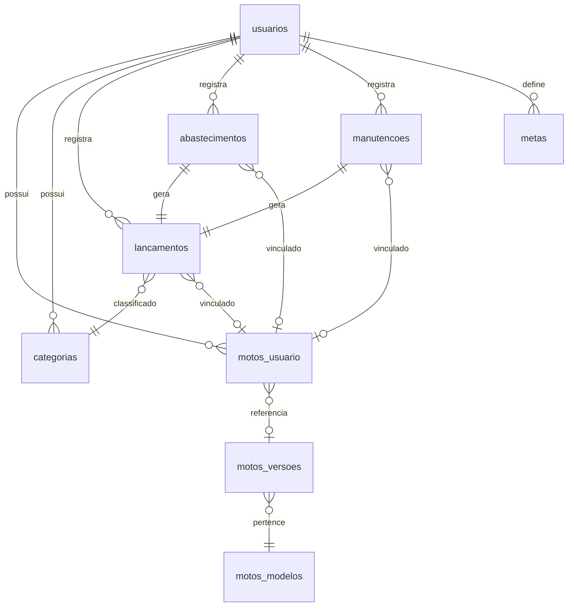

# Documentação Técnica — Gestão Motoca

> Última atualização: 21/07/2026

---

## 1. Visão Geral

**Gestão Motoca** é um sistema de controle financeiro para motoboys/entregadores. O objetivo principal é mostrar o **lucro real** do trabalho, considerando ganhos (corridas, entregas) e todos os custos ligados à moto (combustível, manutenção, financiamento, seguros, multas).

### 1.1 Stack Tecnológica

| Camada | Tecnologias |
|--------|------------|
| **Backend** | Python 3.12, FastAPI 0.129, SQLAlchemy 2.0, Alembic, Pydantic v2 |
| **Frontend** | Vue 3.5, TypeScript, Pinia 3, Vue Router 4, Tailwind CSS 3, Vite 8 |
| **Banco de Dados** | PostgreSQL 16 |
| **Infra** | Docker, Docker Compose |
| **Testes** | Pytest 8 |
| **Auth** | JWT (python-jose) + bcrypt (passlib) |

### 1.2 Arquitetura

O projeto segue uma separação clara em camadas:

```
Backend:  Models → Schemas → Services → Routers
Frontend: Views → Stores → API Modules → Axios Client
```

Comunicação via REST API com autenticação JWT Bearer Token.

---

## 2. Módulos do Sistema

### 2.1 Autenticação e Usuários

**Responsabilidade:** Cadastro de usuário, login, geração/validação de JWT.

**Fluxo:**
1. Usuário se cadastra (`POST /usuarios`) → senha é hashada com bcrypt → categorias padrão são criadas automaticamente.
2. Login (`POST /auth/login`) → valida credenciais → retorna JWT com expiração de 24h.
3. Todas as rotas protegidas usam `Depends(get_usuario_logado)` que extrai o `usuario_id` do token.

**Arquivos:**
- `app/services/usuario_service.py` — Lógica de cadastro e autenticação
- `app/core/security.py` — Hash de senha, geração/validação JWT
- `app/dependencies.py` — Dependency injection de autenticação
- `app/routers/auth.py` — Endpoints `/auth/login` e `/auth/me`
- `app/routers/usuarios.py` — Endpoint `POST /usuarios`

### 2.2 Motos

**Responsabilidade:** Cadastro de motos do usuário com três origens de dados:
- **Catálogo:** Seleciona marca → modelo → ano de uma base interna (`motos_modelos` + `motos_versoes`)
- **Placa (WDAPI):** Consulta API externa (wdapi2.com.br) com cache local em `motos_consultas_wdapi`
- **Manual:** Digita marca, modelo e ano manualmente

**Regra importante:** O usuário precisa ter pelo menos uma moto cadastrada para poder usar as funcionalidades financeiras. O guard de rota do frontend redireciona para `/vincular-moto` se não houver moto.

**Arquivos:**
- `app/models/moto_usuario.py` — Moto vinculada ao usuário
- `app/models/moto_modelo.py` — Catálogo de marcas/modelos
- `app/models/moto_versao.py` — Versões (anos) de cada modelo
- `app/models/moto_consulta_wdapi.py` — Cache de consultas à API de placa
- `app/services/moto_service.py` — Toda a lógica de moto + integração WDAPI
- `app/routers/motos.py` — Endpoints `/motos/*`

### 2.3 Categorias

**Responsabilidade:** Classificação de ganhos e despesas. Cada usuário possui suas próprias categorias (criadas automaticamente no cadastro).

**Tipos:**
- `GANHO` — Entregas (App), Entregas Particulares, Outros Ganhos
- `DESPESA` — Subdivididas por `grupo_despesa`:
  - `GERAL` — Almoço, Café
  - `ABASTECIMENTO` — Combustível
  - `MANUTENCAO` — Troca de Óleo, Relação, Peças/Equipamentos
  - `IMPOSTO` — Financiamento, Seguro, IPVA, Multas

**Exclusão:** Se a categoria já tem lançamentos vinculados, a exclusão é **lógica** (`ativo = false`), preservando o histórico.

**Arquivos:**
- `app/models/categoria.py`
- `app/services/categoria_service.py`
- `app/routers/categorias.py`

### 2.4 Lançamentos

**Responsabilidade:** Registro financeiro central. Cada ganho ou despesa é um lançamento.

**Regras de Negócio:**
- **GANHO** requer `periodo` (`DIARIO` ou `CORRIDA`)
  - `CORRIDA` exige `minutos_corrida` e `km_corrida`
  - `DIARIO` não aceita dados de corrida
- **DESPESA** requer `data_lancamento` e não aceita campos de ganho
- O `dia_semana` é calculado automaticamente pela data do lançamento
- Se o usuário tem 1 moto ativa, ela é atribuída automaticamente; com 2+, precisa informar `moto_usuario_id`
- O tipo do lançamento deve ser compatível com o tipo da categoria

**Suporte a lote:** `POST /lancamentos/lote` permite criar múltiplos lançamentos em uma transação.

**Arquivos:**
- `app/models/lancamento.py`
- `app/schemas/lancamento.py`
- `app/services/lancamento_service.py`
- `app/routers/lancamentos.py`

### 2.5 Abastecimentos

**Responsabilidade:** Registro de abastecimento vinculado a um lançamento de DESPESA.

**Fluxo:** Ao criar um abastecimento, um lançamento de despesa é criado automaticamente. Ao excluir o abastecimento, o lançamento é excluído em cascata.

**Dados específicos:** `litros`, `valor_total`, `valor_litro` (calculado), `km_atual`, `posto`, `tipo_combustivel`.

**Arquivos:**
- `app/models/abastecimento.py`
- `app/services/abastecimento_service.py`
- `app/routers/abastecimentos.py`

### 2.6 Manutenções

**Responsabilidade:** Registro de manutenção vinculado a um lançamento de DESPESA.

**Mesmo fluxo do abastecimento**, com dados específicos: `valor_total`, `km_atual`, `descricao_servico`, `oficina`, `tipo_servico`.

**Arquivos:**
- `app/models/manutencao.py`
- `app/services/manutencao_service.py`
- `app/routers/manutencoes.py`

### 2.7 Indicadores

**Responsabilidade:** Cálculos analíticos sobre os lançamentos.

**Métricas calculadas:**
- Total do período (R$)
- Quantidade de lançamentos
- Ticket médio
- Melhor/pior dia da semana
- Resumo por dia da semana (total + quantidade)
- Calendário do período (total por dia)
- Ganhos por período (DIARIO / CORRIDA)
- Despesas por categoria

**Arquivos:**
- `app/services/indicador_service.py`
- `app/routers/indicadores.py`

### 2.8 Metas

**Responsabilidade:** Definir metas financeiras (ganho ou despesa) por período.

**Tipos:** `GANHO` ou `DESPESA`
**Períodos:** `SEMANAL` ou `MENSAL`

**Sistema de Alertas:**
- Para GANHO: `atingida`, `atencao` (abaixo do ritmo após 70% do período), `em_andamento`
- Para DESPESA: `estourada` (ultrapassou), `atencao` (≥85% do limite), `dentro_meta`

> **Status atual:** Backend completo, sem frontend. A ideia futura é evoluir para um módulo de "Cofre".

**Arquivos:**
- `app/models/meta.py`
- `app/services/meta_service.py`
- `app/routers/metas.py`

### 2.9 Visão do Mês (Dashboard)

**Responsabilidade:** Consolidar todas as informações mensais em uma única resposta.

**Dados retornados:**
- Indicadores de GANHO e DESPESA
- Saldo do mês (`ganho - despesa`)
- Metas ativas
- Alertas mensais
- Resumo executivo (mensagens automáticas de insight)

**Arquivos:**
- `app/services/visao_mes_service.py`
- `app/routers/visao_mes.py`

---

## 3. API — Referência de Endpoints

### 3.1 Autenticação (`/auth`)

| Método | Endpoint | Auth | Descrição |
|--------|----------|------|-----------|
| `POST` | `/auth/login` | ❌ | Login (retorna JWT) |
| `GET` | `/auth/me` | ✅ | Dados do usuário logado |

### 3.2 Usuários (`/usuarios`)

| Método | Endpoint | Auth | Descrição |
|--------|----------|------|-----------|
| `POST` | `/usuarios` | ❌ | Cadastro de novo usuário |

### 3.3 Motos (`/motos`)

| Método | Endpoint | Auth | Descrição |
|--------|----------|------|-----------|
| `GET` | `/motos/marcas` | ❌ | Listar marcas do catálogo |
| `GET` | `/motos/modelos?marca=X` | ❌ | Modelos por marca |
| `GET` | `/motos/anos?modelo_id=X` | ❌ | Anos por modelo |
| `GET` | `/motos/consulta-placa/{placa}` | ✅ | Consulta WDAPI (com cache) |
| `POST` | `/motos/minha` | ✅ | Cadastrar moto (catálogo/manual) |
| `POST` | `/motos/minha/placa` | ✅ | Cadastrar moto por placa |
| `GET` | `/motos/minha` | ✅ | Listar motos do usuário |
| `PUT` | `/motos/minha/{id}` | ✅ | Atualizar moto |
| `PATCH` | `/motos/minha/ativa` | ✅ | Ativar/desativar moto |
| `DELETE` | `/motos/minha/{id}` | ✅ | Excluir moto (se sem registros) |

### 3.4 Categorias (`/categorias`)

| Método | Endpoint | Auth | Descrição |
|--------|----------|------|-----------|
| `GET` | `/categorias` | ✅ | Listar categorias ativas do usuário |
| `POST` | `/categorias` | ✅ | Criar categoria |
| `PUT` | `/categorias/{id}` | ✅ | Atualizar categoria |
| `DELETE` | `/categorias/{id}` | ✅ | Excluir/desativar categoria |

### 3.5 Lançamentos (`/lancamentos`)

| Método | Endpoint | Auth | Descrição |
|--------|----------|------|-----------|
| `POST` | `/lancamentos` | ✅ | Criar lançamento |
| `POST` | `/lancamentos/lote` | ✅ | Criar múltiplos lançamentos |
| `GET` | `/lancamentos` | ✅ | Listar com filtros e paginação |
| `PUT` | `/lancamentos/{id}` | ✅ | Atualizar lançamento |
| `DELETE` | `/lancamentos/{id}` | ✅ | Excluir lançamento |

**Query params do GET:** `tipo`, `data_inicio`, `data_fim`, `categoria_nome`, `valor_min`, `valor_max`, `pagina`, `limite`

### 3.6 Abastecimentos (`/abastecimentos`)

| Método | Endpoint | Auth | Descrição |
|--------|----------|------|-----------|
| `POST` | `/abastecimentos` | ✅ | Criar abastecimento |
| `GET` | `/abastecimentos` | ✅ | Listar abastecimentos |
| `PUT` | `/abastecimentos/{id}` | ✅ | Atualizar abastecimento |
| `DELETE` | `/abastecimentos/{id}` | ✅ | Excluir abastecimento |

### 3.7 Manutenções (`/manutencoes`)

| Método | Endpoint | Auth | Descrição |
|--------|----------|------|-----------|
| `POST` | `/manutencoes` | ✅ | Criar manutenção |
| `GET` | `/manutencoes` | ✅ | Listar manutenções |
| `PUT` | `/manutencoes/{id}` | ✅ | Atualizar manutenção |
| `DELETE` | `/manutencoes/{id}` | ✅ | Excluir manutenção |

### 3.8 Indicadores (`/indicadores`)

| Método | Endpoint | Auth | Descrição |
|--------|----------|------|-----------|
| `GET` | `/indicadores/resumo` | ✅ | Resumo de indicadores por tipo e período |

### 3.9 Metas (`/metas`)

| Método | Endpoint | Auth | Descrição |
|--------|----------|------|-----------|
| `POST` | `/metas` | ✅ | Criar meta |
| `GET` | `/metas` | ✅ | Listar metas |
| `PUT` | `/metas/{id}` | ✅ | Atualizar meta |
| `DELETE` | `/metas/{id}` | ✅ | Excluir meta |
| `GET` | `/metas/alertas` | ✅ | Alertas de progresso das metas |

### 3.10 Visão do Mês (`/visao-mes`)

| Método | Endpoint | Auth | Descrição |
|--------|----------|------|-----------|
| `GET` | `/visao-mes` | ✅ | Dashboard consolidado do mês |

**Query params:** `ano`, `mes`, `data_inicio`, `data_fim`, `moto_usuario_id`

### 3.11 Saúde (`/saude`)

| Método | Endpoint | Auth | Descrição |
|--------|----------|------|-----------|
| `GET` | `/saude` | ❌ | Health check (`{ "status": "ok" }`) |

---

## 4. Banco de Dados

### 4.1 Diagrama ER Simplificado



### 4.2 Migrations (Alembic)

| Versão | Arquivo | Descrição |
|--------|---------|-----------|
| 0001 | `0001_initial_schema.py` | Schema inicial (todas as tabelas) |
| 0002 | `0002_lancamentos_ganho_periodicidade.py` | Adiciona campos de período em lançamentos |
| 0003 | `0003_lancamentos_dia_semana.py` | Adiciona dia_semana em lançamentos |
| 0004 | `0004_lancamentos_periodo_e_dia_semana_opcional.py` | Torna período e dia_semana opcionais |
| 0005 | `0005_metas_usuario.py` | Cria tabela de metas |
| 0006 | `0006_categorias_por_usuario_e_grupo.py` | Categorias por usuário + grupo_despesa |

---

## 5. Frontend — Rotas e Fluxo de Navegação

### 5.1 Guard de Rota

```
Rota acessada
  ├── É pública? (/inicio, /login, /cadastro)
  │     ├── Logado? → Redireciona para /dashboard
  │     └── Não logado? → Permite acesso
  ├── Não logado? → Redireciona para /inicio
  ├── Logado sem moto?
  │     ├── Rota permite sem moto? (vincular-moto, cadastrar-moto) → Permite
  │     └── Outra rota → Redireciona para /vincular-moto
  └── Logado com moto?
        ├── Rota é de vincular-moto? → Redireciona para /dashboard
        └── Permite acesso
```

### 5.2 Rotas

| Rota | View | Público | Requer Moto |
|------|------|---------|-------------|
| `/inicio` | InicioView | ✅ | — |
| `/login` | LoginView | ✅ | — |
| `/cadastro` | CadastroView | ✅ | — |
| `/vincular-moto` | VincularMotoView | ❌ | Acessa SEM moto |
| `/` | DashboardView | ❌ | ✅ |
| `/historico` | HistoricoView | ❌ | ✅ |
| `/lancar` | LancarView | ❌ | ✅ |
| `/abastecer` | AbastecerView | ❌ | ✅ |
| `/manutencao` | ManutencaoView | ❌ | ✅ |
| `/configuracoes` | ConfiguracoesView | ❌ | ✅ |
| `/moto/cadastrar` | CadastrarMotoView | ❌ | Acessa SEM moto |

---

## 6. Como Rodar em Desenvolvimento

### 6.1 Pré-requisitos

- Docker e Docker Compose
- Node.js 18+ e npm
- Python 3.12+ (para rodar testes localmente)

### 6.2 Backend + Banco

```bash
# 1. Copie e configure o .env
cp .env.example .env
# Edite o .env com suas configurações

# 2. Suba banco e API
docker compose up --build

# 3. Rode as migrations (primeira vez)
docker compose exec api alembic upgrade head

# 4. (Opcional) Seed de motos e categorias
docker compose exec db psql -U motoca -d gestao_motoca -f /app/seed_motos.sql
docker compose exec db psql -U motoca -d gestao_motoca -f /app/seed_categorias.sql
```

API disponível em: `http://localhost:8000`
Swagger UI: `http://localhost:8000/docs`

### 6.3 Frontend

```bash
cd frontend
npm install
npm run dev
```

App disponível em: `http://localhost:5173`

### 6.4 Testes

```bash
# Com o banco rodando
pytest -v
```

---

## 7. Variáveis de Ambiente

### 7.1 Backend (`.env`)

| Variável | Descrição | Exemplo |
|----------|-----------|---------|
| `DB_HOST` | Host do PostgreSQL | `localhost` ou `db` (docker) |
| `DB_PORT` | Porta do PostgreSQL | `5432` |
| `DB_NAME` | Nome do banco | `gestao_motoca` |
| `DB_USER` | Usuário do banco | `motoca` |
| `DB_PASSWORD` | Senha do banco | `motoca123` |
| `AUTH_SECRET_KEY` | Chave para JWT | (gere uma chave forte) |
| `AUTH_ALGORITHM` | Algoritmo JWT | `HS256` |
| `AUTH_TOKEN_EXP_MINUTOS` | Expiração do token | `1440` (24h) |
| `WDAPI_TOKEN` | Token de acesso à WDAPI | (obtido no site da WDAPI) |
| `WDAPI_BASE_URL` | URL base da WDAPI | `https://wdapi2.com.br/consulta` |
| `CORS_ORIGINS` | Origens permitidas | `["http://localhost:5173"]` |

### 7.2 Frontend (`.env`)

| Variável | Descrição | Padrão |
|----------|-----------|--------|
| `VITE_API_URL` | URL da API backend | `http://localhost:8000` |

---

## 8. Observações Técnicas

- Abastecimentos e manutenções criam lançamentos de DESPESA automaticamente. A exclusão é em cascata.
- Categorias com lançamentos vinculados são desativadas (soft delete), nunca excluídas fisicamente.
- O sistema de metas calcula progresso em tempo real baseado no período (início/fim da semana ou mês).
- O módulo `visao_mes` é o hub que consolida indicadores + metas + saldo em uma resposta.
- O campo `dia_semana` dos lançamentos é derivado automaticamente da `data_lancamento`.
- Seeds SQL (`seed_motos.sql`, `seed_categorias.sql`) populam o catálogo de motos e categorias globais.
