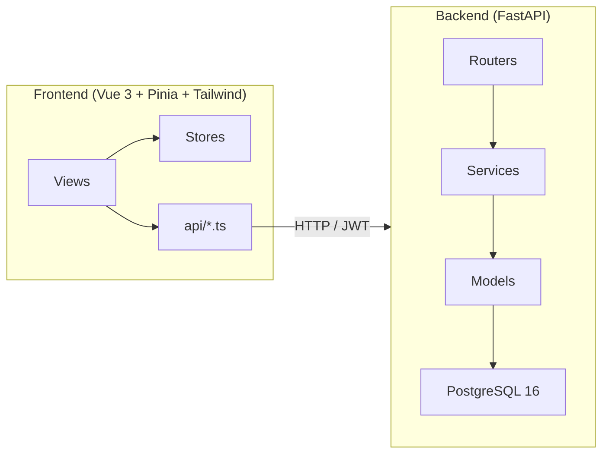
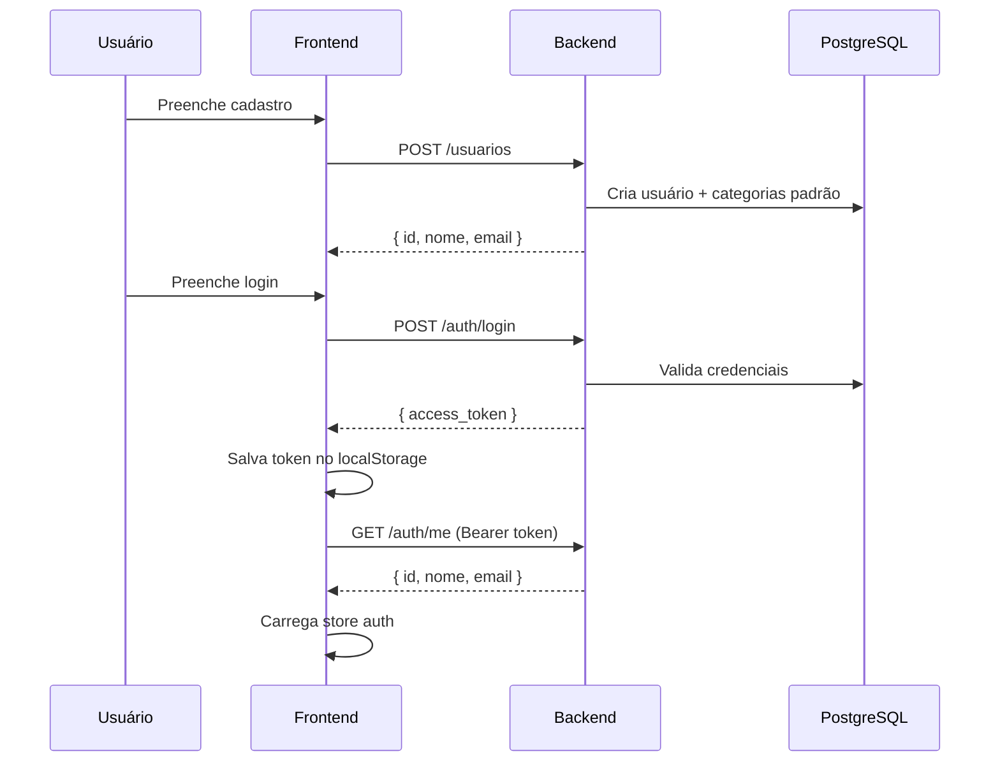
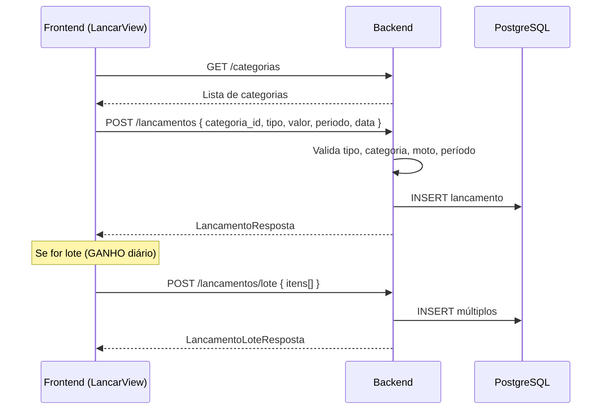
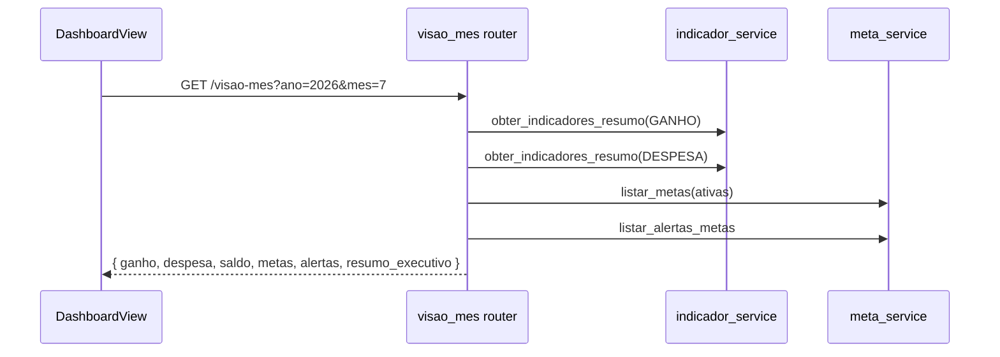

# 🗺️ Mapeamento Completo — Gestão Motoca

> Análise feita em 21/07/2026. Cobre backend (FastAPI), frontend (Vue 3/TS) e infraestrutura.

---

## 1. Visão Geral da Arquitetura



| Camada | Tecnologia | Padrão |
|--------|-----------|--------|
| **Backend** | Python 3.12, FastAPI 0.129, SQLAlchemy 2.0, Alembic | `models → schemas → services → routers` |
| **Frontend** | Vue 3.5, Pinia 3, Vue Router 4, Tailwind 3, Vite 8 | `views → stores → api → client.ts (axios)` |
| **Infra** | Docker, Docker Compose, PostgreSQL 16 | Apenas desenvolvimento |
| **Testes** | Pytest 8 | Testes de serviço + 1 de endpoint |

---

## 2. Módulos do Backend — Inventário Completo

### 2.1 Models (Tabelas)

| Model | Arquivo | Tabela | Status |
|-------|---------|--------|--------|
| `Usuario` | [usuario.py](file:///home/jv/gm/gestao-motoca/app/models/usuario.py) | `usuarios` | ✅ Ativo |
| `MotoModelo` | [moto_modelo.py](file:///home/jv/gm/gestao-motoca/app/models/moto_modelo.py) | `motos_modelos` | ✅ Ativo |
| `MotoVersao` | [moto_versao.py](file:///home/jv/gm/gestao-motoca/app/models/moto_versao.py) | `motos_versoes` | ✅ Ativo |
| `MotoUsuario` | [moto_usuario.py](file:///home/jv/gm/gestao-motoca/app/models/moto_usuario.py) | `motos_usuario` | ✅ Ativo |
| `MotoConsultaWDAPI` | [moto_consulta_wdapi.py](file:///home/jv/gm/gestao-motoca/app/models/moto_consulta_wdapi.py) | `motos_consultas_wdapi` | ✅ Ativo |
| `Categoria` | [categoria.py](file:///home/jv/gm/gestao-motoca/app/models/categoria.py) | `categorias` | ✅ Ativo |
| `Lancamento` | [lancamento.py](file:///home/jv/gm/gestao-motoca/app/models/lancamento.py) | `lancamentos` | ✅ Ativo |
| `Abastecimento` | [abastecimento.py](file:///home/jv/gm/gestao-motoca/app/models/abastecimento.py) | `abastecimentos` | ✅ Ativo |
| `Manutencao` | [manutencao.py](file:///home/jv/gm/gestao-motoca/app/models/manutencao.py) | `manutencoes` | ✅ Ativo |
| `Meta` | [meta.py](file:///home/jv/gm/gestao-motoca/app/models/meta.py) | `metas` | ⚠️ Backend ok, sem frontend |

### 2.2 Routers (Endpoints da API)

| Router | Prefixo | Métodos | Consumido no Frontend? |
|--------|---------|---------|----------------------|
| [auth.py](file:///home/jv/gm/gestao-motoca/app/routers/auth.py) | `/auth` | `POST /login`, `GET /me` | ✅ `api/auth.ts` |
| [usuarios.py](file:///home/jv/gm/gestao-motoca/app/routers/usuarios.py) | `/usuarios` | `POST` | ✅ `api/auth.ts` (criarUsuario) |
| [motos.py](file:///home/jv/gm/gestao-motoca/app/routers/motos.py) | `/motos` | `GET /marcas`, `GET /modelos`, `GET /anos`, `GET /consulta-placa/{placa}`, `POST /minha`, `POST /minha/placa`, `PATCH /minha/ativa`, `PUT /minha/{id}`, `DELETE /minha/{id}`, `GET /minha` | ✅ `api/motos.ts` |
| [categorias.py](file:///home/jv/gm/gestao-motoca/app/routers/categorias.py) | `/categorias` | `GET`, `POST`, `PUT /{id}`, `DELETE /{id}` | ✅ `api/categorias.ts` |
| [lancamentos.py](file:///home/jv/gm/gestao-motoca/app/routers/lancamentos.py) | `/lancamentos` | `POST`, `POST /lote`, `GET`, `PUT /{id}`, `DELETE /{id}` | ✅ `api/lancamentos.ts` |
| [abastecimentos.py](file:///home/jv/gm/gestao-motoca/app/routers/abastecimentos.py) | `/abastecimentos` | `POST`, `GET`, `PUT /{id}`, `DELETE /{id}` | ✅ `api/abastecimentos.ts` |
| [manutencoes.py](file:///home/jv/gm/gestao-motoca/app/routers/manutencoes.py) | `/manutencoes` | `POST`, `GET`, `PUT /{id}`, `DELETE /{id}` | ✅ `api/manutencoes.ts` |
| [indicadores.py](file:///home/jv/gm/gestao-motoca/app/routers/indicadores.py) | `/indicadores` | `GET /resumo` | ⚠️ Consumido indiretamente via `/visao-mes` |
| [metas.py](file:///home/jv/gm/gestao-motoca/app/routers/metas.py) | `/metas` | `POST`, `GET`, `PUT /{id}`, `DELETE /{id}`, `GET /alertas` | ❌ **Sem frontend** (`api/metas.ts` não existe) |
| [visao_mes.py](file:///home/jv/gm/gestao-motoca/app/routers/visao_mes.py) | `/visao-mes` | `GET` | ✅ `api/visaoMes.ts` |

### 2.3 Services

| Service | Arquivo | Responsabilidade |
|---------|---------|-----------------|
| `usuario_service` | [usuario_service.py](file:///home/jv/gm/gestao-motoca/app/services/usuario_service.py) | Cadastro e autenticação |
| `moto_service` | [moto_service.py](file:///home/jv/gm/gestao-motoca/app/services/moto_service.py) | CRUD motos, consulta WDAPI, catálogo |
| `categoria_service` | [categoria_service.py](file:///home/jv/gm/gestao-motoca/app/services/categoria_service.py) | CRUD categorias, seed padrão |
| `lancamento_service` | [lancamento_service.py](file:///home/jv/gm/gestao-motoca/app/services/lancamento_service.py) | CRUD lançamentos, lote, regras ganho/despesa |
| `abastecimento_service` | [abastecimento_service.py](file:///home/jv/gm/gestao-motoca/app/services/abastecimento_service.py) | CRUD abastecimentos (cria lançamento vinculado) |
| `manutencao_service` | [manutencao_service.py](file:///home/jv/gm/gestao-motoca/app/services/manutencao_service.py) | CRUD manutenções (cria lançamento vinculado) |
| `indicador_service` | [indicador_service.py](file:///home/jv/gm/gestao-motoca/app/services/indicador_service.py) | Totais, ticket médio, resumo dia/semana, calendário |
| `meta_service` | [meta_service.py](file:///home/jv/gm/gestao-motoca/app/services/meta_service.py) | CRUD metas, cálculo progresso/alertas |
| `visao_mes_service` | [visao_mes_service.py](file:///home/jv/gm/gestao-motoca/app/services/visao_mes_service.py) | Dashboard mensal (consolida indicadores + metas) |

---

## 3. Módulos do Frontend — Inventário Completo

### 3.1 Views (Páginas)

| View | Rota | Descrição | Status |
|------|------|-----------|--------|
| [InicioView.vue](file:///home/jv/gm/gestao-motoca/frontend/src/views/InicioView.vue) | `/inicio` | Landing page pública | ✅ |
| [LoginView.vue](file:///home/jv/gm/gestao-motoca/frontend/src/views/LoginView.vue) | `/login` | Login | ✅ |
| [CadastroView.vue](file:///home/jv/gm/gestao-motoca/frontend/src/views/CadastroView.vue) | `/cadastro` | Cadastro de usuário | ✅ |
| [VincularMotoView.vue](file:///home/jv/gm/gestao-motoca/frontend/src/views/VincularMotoView.vue) | `/vincular-moto` | Primeira moto (pós-cadastro) | ✅ |
| [DashboardView.vue](file:///home/jv/gm/gestao-motoca/frontend/src/views/DashboardView.vue) | `/` | Dashboard principal (visão do mês) | ✅ |
| [HistoricoView.vue](file:///home/jv/gm/gestao-motoca/frontend/src/views/HistoricoView.vue) | `/historico` | Listagem de lançamentos | ✅ |
| [LancarView.vue](file:///home/jv/gm/gestao-motoca/frontend/src/views/LancarView.vue) | `/lancar` | Novo lançamento (ganho/despesa) | ✅ |
| [AbastecerView.vue](file:///home/jv/gm/gestao-motoca/frontend/src/views/AbastecerView.vue) | `/abastecer` | Registrar abastecimento | ✅ |
| [ManutencaoView.vue](file:///home/jv/gm/gestao-motoca/frontend/src/views/ManutencaoView.vue) | `/manutencao` | Registrar manutenção | ✅ |
| [ConfiguracoesView.vue](file:///home/jv/gm/gestao-motoca/frontend/src/views/ConfiguracoesView.vue) | `/configuracoes` (alias `/moto`) | Configurações + gestão de motos e categorias | ✅ |
| [CadastrarMotoView.vue](file:///home/jv/gm/gestao-motoca/frontend/src/views/CadastrarMotoView.vue) | `/moto/cadastrar` | Cadastro de nova moto | ✅ |

### 3.2 Stores (Estado Global)

| Store | Arquivo | Responsabilidade |
|-------|---------|-----------------|
| `auth` | [auth.ts](file:///home/jv/gm/gestao-motoca/frontend/src/stores/auth.ts) | Token JWT, dados do usuário, login/logout |
| `moto` | [moto.ts](file:///home/jv/gm/gestao-motoca/frontend/src/stores/moto.ts) | Lista de motos, moto ativa |
| `theme` | [theme.ts](file:///home/jv/gm/gestao-motoca/frontend/src/stores/theme.ts) | Tema claro/escuro |

### 3.3 API Modules

| Módulo | Arquivo | Endpoints consumidos |
|--------|---------|---------------------|
| `auth` | [auth.ts](file:///home/jv/gm/gestao-motoca/frontend/src/api/auth.ts) | `/auth/login`, `/auth/me`, `/usuarios` |
| `motos` | [motos.ts](file:///home/jv/gm/gestao-motoca/frontend/src/api/motos.ts) | `/motos/minha`, `/motos/consulta-placa/*`, `/motos/marcas`, `/motos/modelos`, `/motos/anos` |
| `categorias` | [categorias.ts](file:///home/jv/gm/gestao-motoca/frontend/src/api/categorias.ts) | `/categorias` CRUD |
| `lancamentos` | [lancamentos.ts](file:///home/jv/gm/gestao-motoca/frontend/src/api/lancamentos.ts) | `/lancamentos` CRUD + `/lancamentos/lote` |
| `abastecimentos` | [abastecimentos.ts](file:///home/jv/gm/gestao-motoca/frontend/src/api/abastecimentos.ts) | `/abastecimentos` CRUD |
| `manutencoes` | [manutencoes.ts](file:///home/jv/gm/gestao-motoca/frontend/src/api/manutencoes.ts) | `/manutencoes` CRUD |
| `visaoMes` | [visaoMes.ts](file:///home/jv/gm/gestao-motoca/frontend/src/api/visaoMes.ts) | `/visao-mes` |
| ❌ `metas` | **NÃO EXISTE** | `/metas` CRUD + `/metas/alertas` **NÃO CONSUMIDO** |

### 3.4 Componentes

| Componente | Arquivo | Status |
|-----------|---------|--------|
| `AppDateInput` | [AppDateInput.vue](file:///home/jv/gm/gestao-motoca/frontend/src/components/AppDateInput.vue) | ✅ Em uso |
| `LancarDateInput` | [LancarDateInput.vue](file:///home/jv/gm/gestao-motoca/frontend/src/components/LancarDateInput.vue) | ✅ Em uso |
| `ThemeToggle` | [ThemeToggle.vue](file:///home/jv/gm/gestao-motoca/frontend/src/components/ThemeToggle.vue) | ✅ Em uso |
| `HelloWorld` | [HelloWorld.vue](file:///home/jv/gm/gestao-motoca/frontend/src/components/HelloWorld.vue) | ❌ **Código morto** — template padrão do Vite, não é importado em lugar nenhum |

---

## 4. 🔴 Bugs e Problemas Críticos

### 4.1 CORS — Produção vai falhar
- **Arquivo**: [config.py](file:///home/jv/gm/gestao-motoca/app/core/config.py#L27-L38)
- **Problema**: `cors_origins` só lista `localhost`. Em produção, nenhum domínio real vai conseguir chamar a API.
- **Fix**: Adicionar `CORS_ORIGINS` no `.env` com os domínios de produção.

### 4.2 Interceptor de 401 — Pode deslogar usuário por erro de validação
- **Arquivo**: [client.ts](file:///home/jv/gm/gestao-motoca/frontend/src/api/client.ts#L23-L31)
- **Problema**: O interceptor trata **qualquer** resposta 401 fora de `/login` como sessão expirada e faz logout. Se algum endpoint retornar 401 por motivo diferente (ex: antigo bug da consulta de placa), o usuário é deslogado sem motivo.
- **Impacto**: Médio. Atualmente o bug da placa retornando 401 foi corrigido para 422 no [moto_service.py](file:///home/jv/gm/gestao-motoca/app/services/moto_service.py#L253), mas o risco do interceptor genérico permanece.

### 4.3 `AUTH_SECRET_KEY` com fallback inseguro
- **Arquivo**: [config.py](file:///home/jv/gm/gestao-motoca/app/core/config.py#L21-L24)
- **Problema**: O default `"troque-esta-chave-em-producao"` será usado se a variável não estiver no `.env`. Não há validação que impeça subir com o valor default.
- **Fix**: Adicionar validação no startup que cheque se a key é o default e rejeite em `ambiente != "dev"`.

### 4.4 Dockerfile com `--reload` em produção
- **Arquivo**: [Dockerfile](file:///home/jv/gm/gestao-motoca/Dockerfile#L15)
- **Problema**: O CMD usa `--reload`, que é funcionalidade de desenvolvimento. Em produção, causa overhead desnecessário e potenciais reloads acidentais.

### 4.5 Docker Compose com senha fraca
- **Arquivo**: [docker-compose.yml](file:///home/jv/gm/gestao-motoca/docker-compose.yml#L8)
- **Problema**: `POSTGRES_PASSWORD: motoca123` hardcoded. Aceitável para dev, perigoso se copiado para produção.

---

## 5. ⚠️ Código Morto / Arquivos para Remover

| Arquivo | Motivo | Ação |
|---------|--------|------|
| [HelloWorld.vue](file:///home/jv/gm/gestao-motoca/frontend/src/components/HelloWorld.vue) | Template padrão do Vite, não importado em nenhum lugar | 🗑️ Remover |
| `frontend/src/assets/vite.svg`, `hero.png`, `vue.svg` | Assets referenciados apenas no HelloWorld.vue | 🗑️ Verificar e remover se órfãos |
| [prompt_ia/](file:///home/jv/gm/gestao-motoca/prompt_ia) | Prompts antigos de IA — não é código do projeto | 🗑️ Remover (ou mover para `.gitignore`) |
| [stitch/](file:///home/jv/gm/gestao-motoca/stitch) | Mockups/screenshots de UI antigas — 15 pastas | 🗑️ Remover (ou mover para `.gitignore`) |
| `.codex` | Arquivo de configuração de outro agente de IA | 🗑️ Remover |
| `mcp.json` | Configuração de MCP server (não é parte do app) | 🗑️ Remover |
| [app/routers/saude.py](file:///home/jv/gm/gestao-motoca/app/routers/saude.py) | Arquivo vazio — o endpoint `/saude` está em `main.py` | 🗑️ Remover |

---

## 6. ⚠️ Módulo Metas — Código Backend sem Frontend

O módulo de **Metas** está 100% implementado no backend:

| Camada | Arquivo |
|--------|---------|
| Model | [meta.py](file:///home/jv/gm/gestao-motoca/app/models/meta.py) |
| Schema | [meta.py](file:///home/jv/gm/gestao-motoca/app/schemas/meta.py) |
| Service | [meta_service.py](file:///home/jv/gm/gestao-motoca/app/services/meta_service.py) |
| Router | [metas.py](file:///home/jv/gm/gestao-motoca/app/routers/metas.py) |
| Types (frontend) | [types/index.ts](file:///home/jv/gm/gestao-motoca/frontend/src/types/index.ts#L245-L286) — types **existem** |

**O que falta:**
- ❌ `frontend/src/api/metas.ts` — módulo de API
- ❌ View/componente para criar/listar/editar metas
- ❌ Mostrar alertas de metas no Dashboard

> [!IMPORTANT]
> O `visao_mes_service` já consome metas internamente e retorna `metas_ativas` e `alertas_mensais` na response do dashboard. Porém, o frontend ignora esses dados — eles vêm na response mas não são renderizados.

---

## 7. 🟡 Melhorias Menores

### 7.1 `HistoricoView.vue` — Mapa de dias em inglês nunca usado
- **Arquivo**: [HistoricoView.vue](file:///home/jv/gm/gestao-motoca/frontend/src/views/HistoricoView.vue)
- Tem um mapa `formatarDiaSemana` com chaves em inglês (`MONDAY`, `TUESDAY`...) mas o backend manda em português (`SEGUNDA`, `TERCA`...). Cai no fallback `slice(0,3)` que por coincidência funciona — mas é código confuso.

### 7.2 Sem testes de frontend
- Zero testes de componentes Vue
- Sem Vitest ou Cypress configurado

### 7.3 Sem testes de API/router
- Os testes existentes testam services diretamente
- Apenas [test_api_endpoints.py](file:///home/jv/gm/gestao-motoca/tests/test_api_endpoints.py) testa rotas HTTP

### 7.4 Sem `.env` no frontend
- O `baseURL` do axios agora usa `import.meta.env.VITE_API_URL ?? 'http://localhost:8000'`
- Mas não existe arquivo `.env` ou `.env.example` no frontend para documentar a variável

### 7.5 Indicadores não são consumidos diretamente
- O router [indicadores.py](file:///home/jv/gm/gestao-motoca/app/routers/indicadores.py) existe mas o frontend não tem `api/indicadores.ts`
- Os indicadores são consumidos via `/visao-mes` que internamente chama `indicador_service`

---

## 8. Mapa de Fluxos — Backend ↔ Frontend

### 8.1 Fluxo de Autenticação



### 8.2 Fluxo de Lançamento



### 8.3 Fluxo do Dashboard



---

## 9. Próximos Passos Recomendados

### Fase 1 — Limpeza (Sem risco, pode fazer agora)

- [ ] Remover [HelloWorld.vue](file:///home/jv/gm/gestao-motoca/frontend/src/components/HelloWorld.vue) e assets órfãos
- [ ] Remover [saude.py](file:///home/jv/gm/gestao-motoca/app/routers/saude.py) (vazio)
- [ ] Remover pastas `prompt_ia/` e `stitch/` (ou adicionar ao `.gitignore`)
- [ ] Remover `.codex` e `mcp.json`
- [ ] Corrigir mapa de dias da semana no `HistoricoView.vue`
- [ ] Criar `frontend/.env.example` com `VITE_API_URL=http://localhost:8000`

### Fase 2 — Bugs Críticos

- [ ] Adicionar validação de `AUTH_SECRET_KEY` no startup para ambientes não-dev
- [ ] Criar `Dockerfile.prod` sem `--reload` e com `--workers`
- [ ] Separar `docker-compose.prod.yml` com senha segura via variável de ambiente
- [ ] Tornar `CORS_ORIGINS` configurável via `.env` (já é, mas precisa incluir domínios reais)

### Fase 3 — Conectar Frontend de Metas

- [ ] Criar `frontend/src/api/metas.ts` consumindo `POST/GET/PUT/DELETE /metas` e `GET /metas/alertas`
- [ ] Criar uma seção de metas no `ConfiguracoesView.vue` ou uma view dedicada
- [ ] Renderizar `alertas_mensais` e `metas_ativas` no `DashboardView.vue` (dados já vêm na response)

### Fase 4 — Evolução (Cofre / Futuro)

- [ ] Definir se o Cofre será evolução do módulo de Metas ou módulo separado
- [ ] Implementar Cofre (schema, service, router + frontend)
- [ ] Adicionar testes de frontend (Vitest)
- [ ] Adicionar testes de endpoint (TestClient) para todos os routers
- [ ] Implementar paginação nos abastecimentos e manutenções (hoje retornam lista completa)
- [ ] Considerar WebSockets ou polling para atualização em tempo real do dashboard

---

## 10. Estrutura de Arquivos Completa

```
gestao-motoca/
├── app/
│   ├── core/
│   │   ├── config.py          # Settings (DB, auth, CORS, WDAPI)
│   │   └── security.py        # Hash, JWT, verificação
│   ├── database/
│   │   ├── base.py            # DeclarativeBase
│   │   └── session.py         # get_db (sessionmaker)
│   ├── models/
│   │   ├── __init__.py        # Exporta todos os models
│   │   ├── usuario.py
│   │   ├── moto_modelo.py
│   │   ├── moto_versao.py
│   │   ├── moto_usuario.py
│   │   ├── moto_consulta_wdapi.py
│   │   ├── categoria.py
│   │   ├── lancamento.py
│   │   ├── abastecimento.py
│   │   ├── manutencao.py
│   │   └── meta.py
│   ├── schemas/
│   │   ├── auth.py
│   │   ├── usuario.py
│   │   ├── moto.py
│   │   ├── categoria.py
│   │   ├── lancamento.py
│   │   ├── abastecimento.py
│   │   ├── manutencao.py
│   │   ├── indicador.py
│   │   ├── meta.py
│   │   └── visao_mes.py
│   ├── services/
│   │   ├── usuario_service.py
│   │   ├── moto_service.py
│   │   ├── categoria_service.py
│   │   ├── lancamento_service.py
│   │   ├── abastecimento_service.py
│   │   ├── manutencao_service.py
│   │   ├── indicador_service.py
│   │   ├── meta_service.py
│   │   └── visao_mes_service.py
│   ├── routers/
│   │   ├── _errors.py         # raise_mapped_error
│   │   ├── auth.py
│   │   ├── usuarios.py
│   │   ├── motos.py
│   │   ├── categorias.py
│   │   ├── lancamentos.py
│   │   ├── abastecimentos.py
│   │   ├── manutencoes.py
│   │   ├── indicadores.py
│   │   ├── metas.py
│   │   ├── visao_mes.py
│   │   └── saude.py           # ❌ VAZIO (remover)
│   ├── dependencies.py        # get_usuario_logado
│   └── main.py                # FastAPI app + CORS + routers
├── frontend/
│   ├── src/
│   │   ├── api/               # Módulos axios
│   │   ├── assets/
│   │   ├── components/
│   │   ├── router/index.ts    # Vue Router + guards
│   │   ├── stores/            # Pinia stores
│   │   ├── types/index.ts     # Interfaces TypeScript
│   │   ├── views/             # Páginas Vue
│   │   ├── App.vue
│   │   ├── main.ts
│   │   └── style.css
│   ├── package.json
│   └── vite.config.ts
├── alembic/                   # Migrations (6 versões)
├── tests/                     # Pytest
├── docker-compose.yml         # Dev only
├── Dockerfile                 # Dev only (--reload)
├── requirements.txt
├── .env / .env.example
├── seed_categorias.sql
└── seed_motos.sql
```
